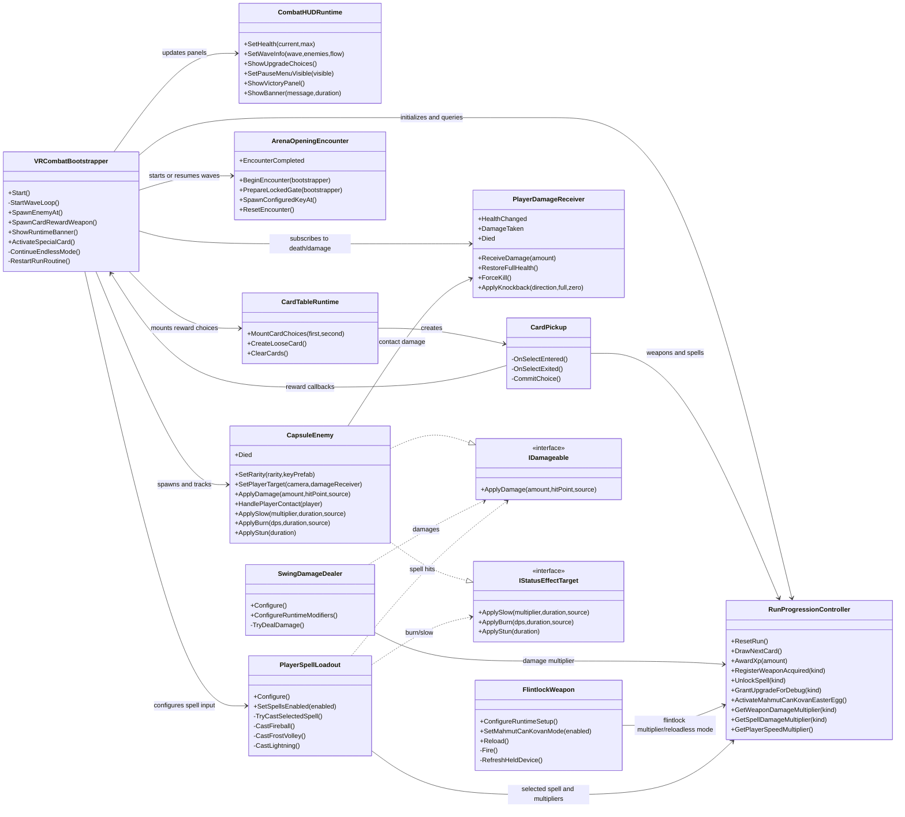
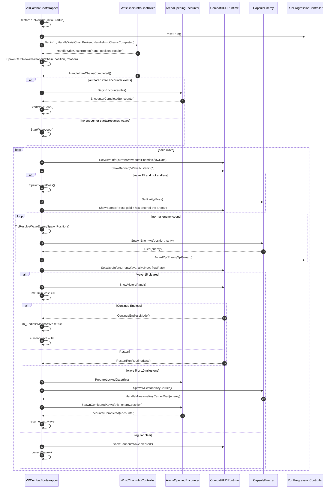
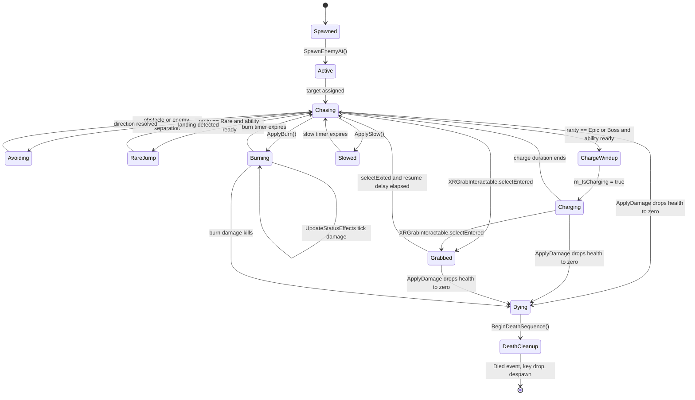
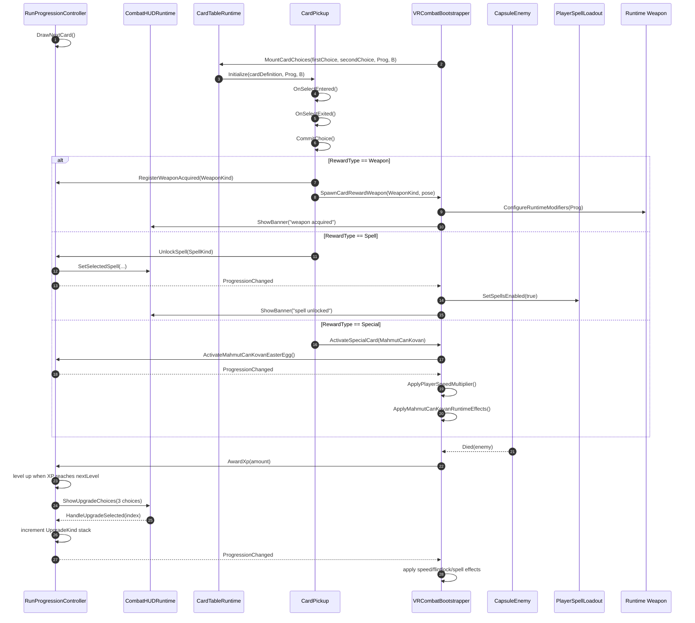
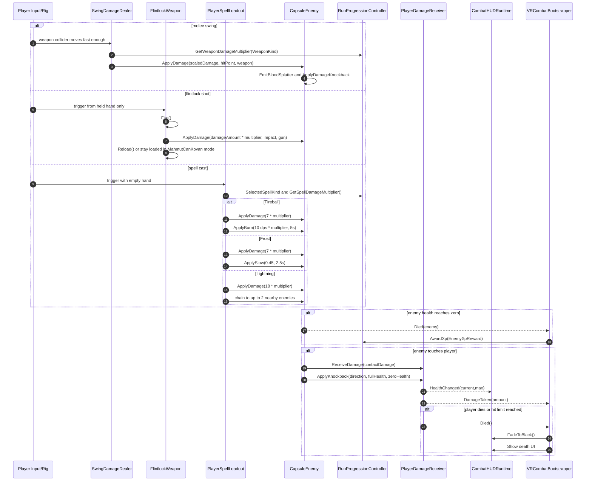
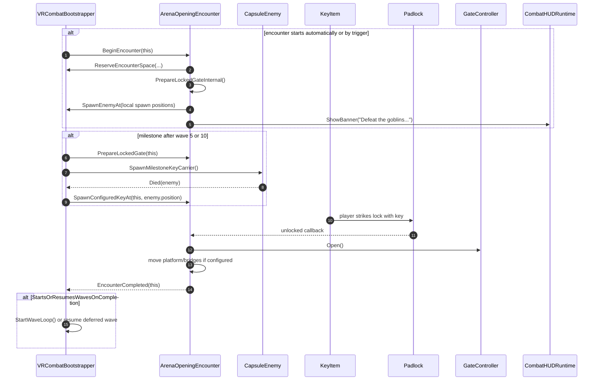

# Core Mechanics UML

These Mermaid diagrams are based on the current runtime code under `Assets/Scripts`.
They focus on presentation-level structure while keeping class and method names tied to the implementation.

## Source Map

- `Assets/Scripts/Core/VRCombatBootstrapper.cs`: run orchestration, wave loop, spawning, boss/victory, pause/restart, card rewards.
- `Assets/Scripts/Core/RunProgressionController.cs`: XP, level-up choices, owned weapons, unlocked spells, upgrade multipliers, MahmutCanKovan flags.
- `Assets/Scripts/Core/CardTableRuntime.cs`: physical card table, card pickup/drop activation.
- `Assets/Scripts/Enemies/CapsuleEnemy.cs`: enemy AI, rarity scaling, boss stats, health, contact damage, status effects, death.
- `Assets/Scripts/Player/PlayerSpellLoadout.cs`: selected spell, hand input, spell casting, projectile/status behavior.
- `Assets/Scripts/Combat/SwingDamageDealer.cs`: melee collision damage, swing-speed scaling, progression multipliers.
- `Assets/Scripts/Combat/FlintlockWeapon.cs`: held-hand firing, reload state, projectile/hitscan impact.
- `Assets/Scripts/Environment/ArenaOpeningEncounter.cs`: authored encounter gates, key carrier flow, wave resume.
- `Assets/Scripts/UI/CombatHUDRuntime.cs`: HUD panels for health, waves, upgrades, pause, debug, victory.

## 1. Runtime Component Class Diagram

## 2. Run And Wave Progression Sequence

## 3. Enemy Lifecycle State Diagram

## 4. Card Reward And Upgrade Flow

## 5. Combat Damage Sequence

## 6. Encounter And Milestone Gate Sequence

